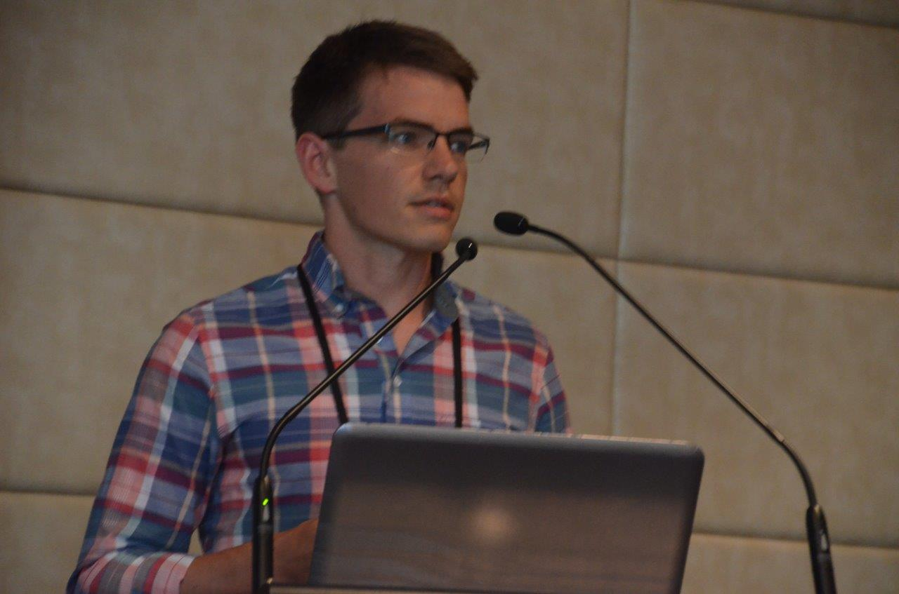



Hello and welcome to my website.  I am a statistical scientist at the Pacific Northwest National Labs.  My research interests are: statistical methods for data on manifolds, uncertainty quantification of complex computer models and agricultural statistics.  

<!---
## Recent posts

An introduction to the  [`rotations`](http://cran.r-project.org/web/packages/rotations/index.html) package in R:

<ul class="posts">
  
    <li>{{ post.date | date_to_string }} &raquo; <a href="{{ BASE_PATH }}{{ post.url }}">{{ post.title }}</a></li>
  
</ul>

--->

